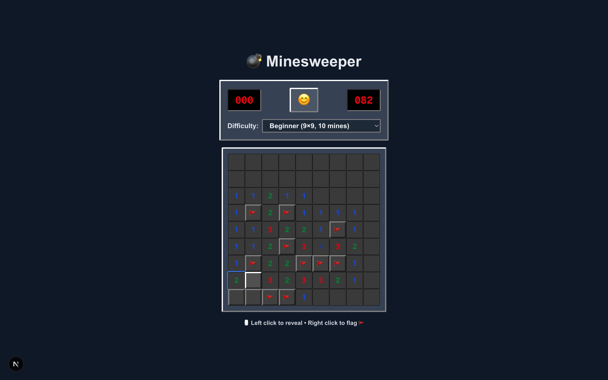

# 💣 Minesweeper

> Đôi lời về dự án:
>
> - 🎮 **Minesweeper** — hay còn gọi là _"game đào mìn"_ — là trò chơi quen thuộc trên những máy tính chạy **Windows XP**, gắn liền với tuổi thơ của thế hệ 8x–9x.
> - 🤖 Vì thế tôi muốn tự làm lại phiên bản _"game đào mìn"_ này. Đây cũng là project đầu tiên tôi thử nghiệm để **AI Agent tạo ra 100% code**.
> - 👉🏻 Đầu tiên tôi đưa ý tưởng cho **ChatGPT**. Sau khi chọn được hướng phát triển từ gợi ý của AI, tôi yêu cầu AI cung cấp **các prompt theo từng bước (step-by-step)** để dùng với **AI Agent (claude-4.5-sonet)** trên **IDE Cursor**.
>
> ---
>
> About this project:
>
> - 🎮 **Minesweeper** — also known as the classic _“mine digging” game_ — was pre-installed on **Windows XP** and is deeply familiar to many people born in the late 80s and 90s.
> - 🤖 I decided to recreate this game myself. This is also my first project in which I experimented with letting **an AI agent generate 100% of the code**.
> - 👉🏻 First, I provide the idea to **ChatGPT**. After selecting a development direction from the AI's suggestions, I ask the AI to generate **step-by-step prompts** to feed into the **AI agent (claude-4.5-sonet)** on the **Cursor IDE**.

## 🖼️ Image Demo

- **3 Game Levels:**

  | Beginner 9x9                                                        | Intermediate 16x16                                                          | Expert 16x30                                                    |
  | ------------------------------------------------------------------- | --------------------------------------------------------------------------- | --------------------------------------------------------------- |
  |  |  |  |

- **Try Play:**

  |                                                         |                                                         |
  | ------------------------------------------------------- | ------------------------------------------------------- |
  |  |  |

- **Win/Lose:**

  |                                                         |                                                     |                                                         |
  | ------------------------------------------------------- | --------------------------------------------------- | ------------------------------------------------------- |
  |  |  |  |

## 🎯 TL;DR

- **Classic Retro Minesweeper** with authentic Windows XP style
- **Retro 3D bevel effects** matching the original game aesthetics
- **3 difficulty levels** (Beginner, Intermediate, Expert)
- **Auto-open/Chording** - click revealed numbers to auto-reveal neighbors
- **Highscore tracking** with localStorage persistence
- **100% TypeScript** with strict mode
- **47 unit tests** + E2E tests with Playwright
- **State machine architecture** with reducer pattern

[Play Demo](https://minesweeper-aiagent-trung.vercel.app) • [View Tests](https://github.com/TrungKuro/minesweeper/tree/main/tests)

## 🚀 Quick Start

### Prerequisites

- Node.js 20.x or higher
- npm or yarn

### Installation

```bash
# Clone the repository
git clone https://github.com/TrungKuro/minesweeper.git
cd minesweeper

# Install dependencies
npm install

# Run development server
npm run dev
```

Open [http://localhost:3000](http://localhost:3000) to play!

### Available Scripts

```bash
npm run dev          # Start development server
npm run build        # Build for production
npm run start        # Start production server
npm run lint         # Run ESLint
npm test             # Run unit tests
npm run test:watch   # Run tests in watch mode
npm run test:e2e     # Run Playwright E2E tests
npm run test:e2e:ui  # Run E2E tests with UI
```

## 🎮 How to Play

1. **Left-click** to reveal a cell
2. **Right-click** to place/remove a flag
3. **Click on revealed numbers** (when flags = adjacent mines) to auto-reveal neighbors
4. Numbers show how many mines are adjacent
5. Flag all mines and reveal all safe cells to win!

### Difficulty Levels

| Level        | Grid  | Mines |
| ------------ | ----- | ----- |
| Beginner     | 9×9   | 10    |
| Intermediate | 16×16 | 40    |
| Expert       | 16×30 | 99    |

## 🏗️ Architecture

### Tech Stack

- **Framework:** Next.js 15 (App Router)
- **Language:** TypeScript (strict mode)
- **Styling:** Tailwind CSS 4 with custom theme tokens
- **Animations:** Framer Motion
- **State Management:** React useReducer with custom hook
- **Testing:** Vitest (unit) + Playwright (E2E)
- **Storage:** localStorage for highscores

### Project Structure

```
src/
├── app/                    # Next.js app router
│   ├── page.tsx           # Main game page
│   └── globals.css        # Global styles + theme tokens
├── components/
│   ├── Game/              # Main game orchestrator
│   ├── Board/             # Board and Cell components
│   └── Header/            # Timer, mine counter, controls
├── hooks/
│   ├── useGameReducer.ts  # Game state management
│   └── useLocalStorage.ts # Persistent storage hook
├── lib/
│   └── board.ts           # Board generation & flood-fill
└── types/
    └── game.ts            # TypeScript type definitions

tests/
├── board.test.ts          # Unit tests for board logic
└── reducer.test.ts        # Unit tests for game reducer

e2e/
└── minesweeper.spec.ts    # Playwright E2E tests
```

### State Machine

The game uses a reducer-based state machine with the following states:

```
IDLE → PLAYING → (WON | LOST)
  ↓       ↓
RESET ← ←
```

**Game States:**

- `IDLE`: Initial state, waiting for first click
- `PLAYING`: Game in progress, timer running
- `WON`: All non-mine cells revealed
- `LOST`: Mine exploded

**Actions:**

- `NEW_GAME`: Initialize new game with difficulty settings
- `REVEAL_CELL`: Reveal a cell (first click generates board)
- `TOGGLE_FLAG`: Place/remove flag on cell
- `AUTO_OPEN`: Auto-reveal neighbors (chording)
- `RESET_GAME`: Return to IDLE state

### Key Features Implementation

#### First-Click Safety

When you click the first cell, the board is generated **after** the click, ensuring that cell and its 8 neighbors never contain mines.

```typescript
generateBoard(rows, cols, mines, excludeId)
```

#### Flood-Fill Algorithm

When revealing a cell with 0 adjacent mines, an iterative flood-fill algorithm reveals all connected safe cells:

```typescript
revealFlood(board, rows, cols, startId)
```

- Uses a stack (not recursion) for performance
- Stops at numbered cells (cells with adjacent mines)
- Respects flags and already-revealed cells

#### Auto-Open/Chording

Click on a revealed number to auto-reveal all unflagged neighbors if the number of flags equals the adjacent mine count:

```typescript
// If cell shows "3" and has 3 flags around it
// Click the cell → auto-reveal all unflagged neighbors
```

#### Win Detection

Game checks for win condition after every reveal:

```typescript
allNonMinesRevealed = board.every(cell =>
  cell.isMine || cell.isRevealed
)
```

#### Highscore Persistence

Highscores are automatically saved to localStorage when you win:

```typescript
saveHighscore(difficulty, {
  name: 'Anonymous',
  time: seconds,
  date: new Date().toISOString()
})
```

## 🎨 Design System

### Retro Windows XP Style

Authentic recreation of the classic Minesweeper aesthetic:

**Color Palette:**

- Silver gray backgrounds (`#c0c0c0`)
- Classic 3D bevel borders (white highlight, gray shadow)
- Traditional number colors matching Windows XP:
  - 1: Blue (#1e40af)
  - 2: Green (#15803d)
  - 3: Red (#dc2626)
  - 4: Dark Blue (#1e3a8a)
  - 5: Maroon (#7f1d1d)
  - 6: Cyan (#0891b2)
  - 7: Black (#000000)
  - 8: Gray (#4b5563)

**3D Bevel Effect:**

```css
/* Unrevealed cells with raised 3D effect */
border-top: 3px solid #ffffff; /* Light highlight */
border-left: 3px solid #ffffff;
border-right: 3px solid #808080; /* Dark shadow */
border-bottom: 3px solid #808080;

/* Revealed cells with flat inset */
border: 1px solid #7b7b7b;
```

**Typography:**

- Arial font family (matching classic Windows)
- Bold numbers for better visibility
- Red LED-style display for timer and mine counter

### Animations

Minimal animations to preserve retro feel:

- **Tap:** Subtle scale down (0.98) for tactile feedback
- **Flag toggle:** Smooth 3D flip animation
- **Reveal:** Quick fade-in transition
- No hover scale effects (maintaining classic behavior)

### Dark Mode Support

Retro style preserved in dark mode with adjusted colors:

- Darker silver gray (`#404040`)
- Adjusted bevel colors for contrast
- Same number color scheme for consistency

## 🧪 Testing

### Unit Tests (47 tests)

```bash
npm test
```

**Coverage:**

- ✅ Board generation (mine placement, adjacentMines calculation)
- ✅ Flood-fill algorithm
- ✅ Exclude zone on first click
- ✅ Game reducer (all actions and state transitions)
- ✅ Win/loss detection
- ✅ Auto-open/chording logic

### E2E Tests (Playwright)

```bash
npm run test:e2e
```

**Flows tested:**

- ✅ Reveal cell on click
- ✅ Place/remove flag with right-click
- ✅ Change difficulty
- ✅ Restart game
- ✅ Win flow
- ✅ Mine counter updates
- ✅ Timer functionality

### CI/CD

GitHub Actions workflow runs on every push:

1. Install dependencies
2. Run linter
3. Run unit tests
4. Build application
5. Run E2E tests

## 📚 What I Learned

### Technical Insights

**✅ State Management**

- Reducer pattern scales better than useState for complex state
- Immutable updates are crucial for React optimization
- Callbacks in reducers enable side effects (highscore saving)

**✅ Algorithm Design**

- Iterative > recursive for flood-fill (avoid stack overflow)
- Fisher-Yates shuffle for unbiased mine placement
- Flat arrays with calculated indices > 2D arrays for performance

**✅ TypeScript**

- Discriminated unions for actions provide perfect type safety
- `React.memo` with proper comparison prevents expensive re-renders
- Strict mode catches subtle bugs early

**✅ Animation Performance**

- Framer Motion's layout animations can cause jank with many elements
- Individual cell animations > animating entire board
- `AnimatePresence` crucial for exit animations

**✅ Testing Strategy**

- Unit tests for pure functions (board.ts) are fast and reliable
- E2E tests catch integration issues unit tests miss
- Testing state machines requires careful setup of preconditions

### Architecture Decisions

**Why Reducer over Context?**

- Single source of truth
- Predictable state transitions
- Easy to test in isolation
- Time-travel debugging possible

**Why Flat Board Array?**

- Simpler serialization for localStorage
- Better memory locality
- Easier to map over for rendering
- Index calculation is cheap: `row * cols + col`

**Why localStorage over Database?**

- No backend needed
- Instant persistence
- Works offline
- Perfect for single-player game

### Gotchas & Solutions

**Problem:** First click could hit a mine
**Solution:** Generate board AFTER first click, exclude clicked cell + neighbors

**Problem:** Flood-fill causing stack overflow
**Solution:** Iterative algorithm with explicit stack (array)

**Problem:** Cell re-renders causing animation stutters
**Solution:** React.memo with proper dependency tracking

**Problem:** Dark mode transitions jarring
**Solution:** CSS custom properties with smooth transitions

**Problem:** E2E tests flaky due to animations
**Solution:** Wait for animations with `waitForTimeout()`

### Performance Optimizations

1. **Memoized Components:** `React.memo` on Cell prevents 256+ re-renders per click
2. **Callback Stability:** `useCallback` prevents prop changes triggering re-renders
3. **Flat Data Structure:** O(1) cell lookup vs O(n) array search
4. **CSS Variables:** Better performance than inline styles for theming
5. **Minimal Animations:** Reduced animation complexity for smoother gameplay
6. **Retro-first Design:** Native CSS borders instead of complex gradients

### Recent Updates (October 2025)

**✅ Retro UI Overhaul**

- Implemented authentic Windows XP Minesweeper aesthetic
- Classic 3D bevel borders with light/shadow effects
- Traditional color scheme for numbers (1=Blue, 2=Green, 3=Red, etc.)
- LED-style red display for timer and mine counter
- Arial font matching original Windows design
- Minimal animations to preserve classic feel
- Fixed React effect warning in Header component

### Future Improvements

- [ ] Custom difficulty settings
- [ ] Online leaderboard
- [ ] Multiplayer mode
- [ ] Mobile touch gestures (long-press for flag)
- [ ] Sound effects (retro Windows XP sounds)
- [ ] Undo/redo functionality
- [ ] Hint system
- [ ] Statistics dashboard
- [ ] Accessibility improvements (keyboard navigation)
- [ ] Question mark mode (? flag)

## 📝 License

MIT

## 🙏 Acknowledgments

- Classic Minesweeper by Microsoft
- [Next.js](https://nextjs.org/) team for amazing framework
- [Framer Motion](https://www.framer.com/motion/) for smooth animations
- [Tailwind CSS](https://tailwindcss.com/) for utility-first styling

---

Built with ❤️ by TrungKuro (AI Agent)
